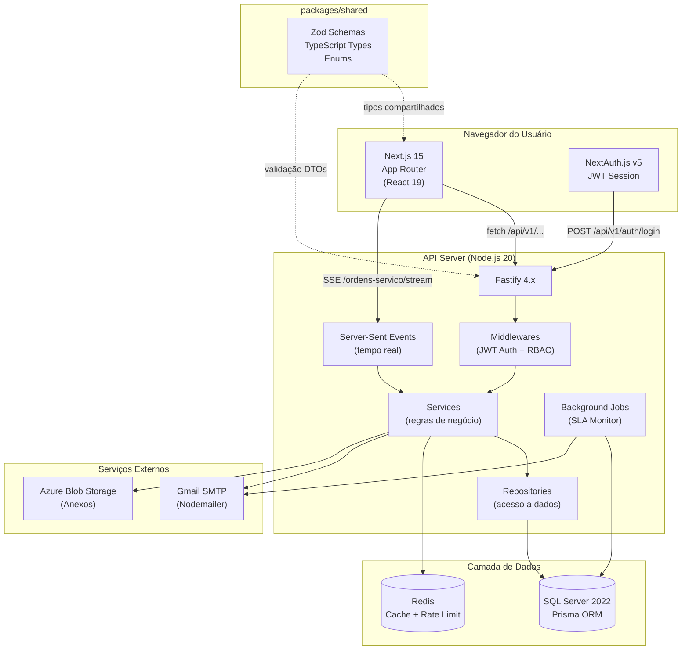
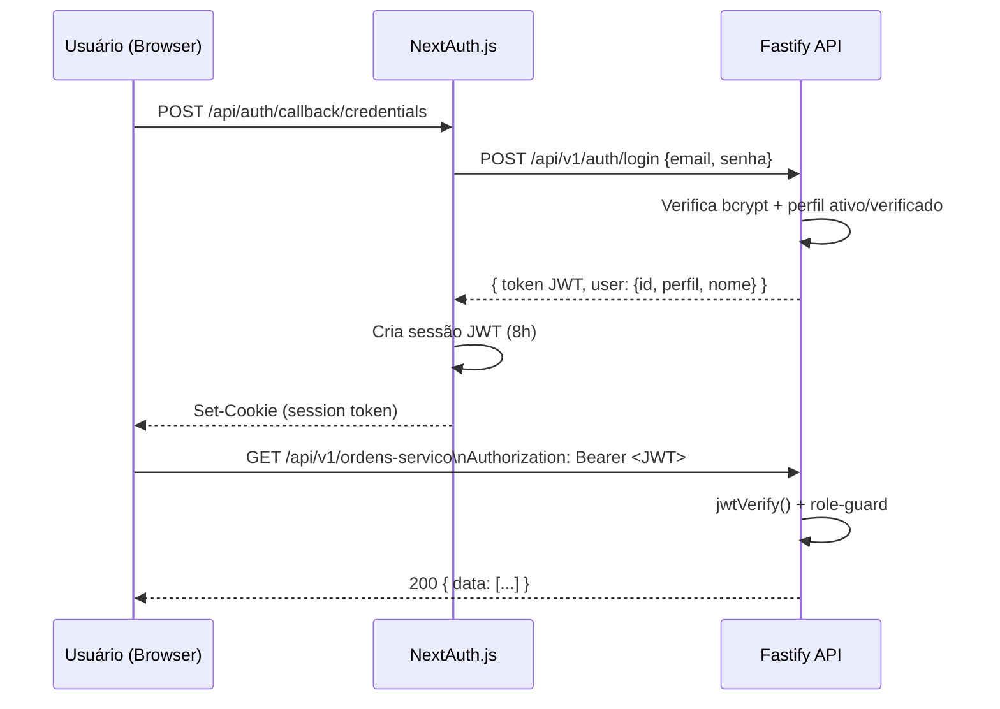

# 01 — Visão Geral do Sistema

## O que é o Metalsider?

O **Metalsider** é um sistema web de **gestão de ordens de serviço mecânico** para frotas industriais. Ele centraliza o ciclo de vida completo das manutenções: da abertura do chamado, passando pela atribuição ao mecânico, acompanhamento em tempo real, até o fechamento com registro de horas e resultado.

**Problema que resolve:** equipes de manutenção que gerenciam frotas de veículos/equipamentos industriais frequentemente perdem rastreabilidade — chamados esquecidos, atrasos sem alertas, sem histórico auditável e sem visibilidade de produtividade por mecânico. O Metalsider resolve isso com fluxo estruturado, SLA automático, auditoria imutável e dashboard analítico.

---

## Stack Tecnológica

| Camada | Tecnologia | Versão |
|---|---|---|
| **Frontend** | Next.js + React | 15 / 19 |
| **Estilos** | CSS Modules + Design Tokens | — |
| **Ícones** | Tabler Icons React | — |
| **Autenticação Web** | NextAuth.js (Credentials + JWT) | v5 |
| **Backend/API** | Fastify + Node.js | 4.x / 20 LTS |
| **Linguagem** | TypeScript | 5.x |
| **ORM** | Prisma | 5.x |
| **Banco de Dados** | SQL Server 2022+ / Azure SQL | — |
| **Validação** | Zod (frontend + backend) | — |
| **Cache** | Redis + ioredis | — |
| **E-mail** | Nodemailer (SMTP Gmail) | — |
| **Uploads** | Azure Blob Storage (SAS tokens) | — |
| **Monorepo** | pnpm workspaces | 11.x |
| **Testes** | Vitest (web) + Jest/Supertest (api) | — |
| **CI/CD** | GitHub Actions | — |
| **Containers** | Docker Compose (SQL Server + Redis) | — |

---

## Estrutura do Monorepo

```
Mecanica_system/
├── apps/
│   ├── api/          ← Fastify REST API (Node.js)
│   └── web/          ← Next.js 15 App Router (frontend)
├── packages/
│   └── shared/       ← Schemas Zod + Types + Enums compartilhados
├── docs/             ← Documentação técnica (esta pasta)
├── docker-compose.yml
├── pnpm-workspace.yaml
└── CLAUDE.md         ← Regras do projeto
```

---

## Diagrama de Arquitetura



---

## Fluxo de Autenticação (Resumo)



---

## Ambientes e Portas

| Serviço | Porta padrão | Variável |
|---|---|---|
| Next.js (frontend) | `3000` | `WEB_PORT` |
| Fastify (API) | `4000` | `API_PORT` |
| SQL Server | `1433` | `DATABASE_URL` |
| Redis | `6379` | `REDIS_URL` |

---

## Variáveis de Ambiente Essenciais

| Variável | Onde | Descrição |
|---|---|---|
| `DATABASE_URL` | API | Connection string SQL Server |
| `JWT_SECRET` | API | Chave de assinatura dos JWTs |
| `REDIS_URL` | API | Conexão com Redis |
| `NEXTAUTH_SECRET` | Web | Chave das sessões NextAuth |
| `NEXT_PUBLIC_API_URL` | Web | URL base da API (`http://localhost:4000/api/v1`) |
| `EMAIL_USER` / `EMAIL_PASSWORD` | API | Credenciais Gmail SMTP |
| `AZURE_STORAGE_CONNECTION` | API | Blob Storage para uploads |

> Veja o arquivo `.env.example` na raiz do projeto para a lista completa.
