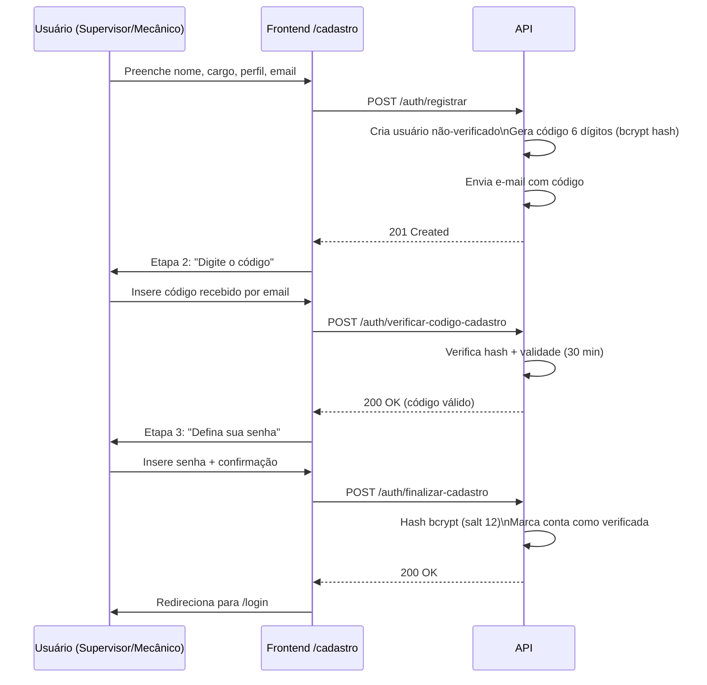

# 02 — Casos de Uso

## Atores do Sistema

| Ator | Descrição | Como é criado |
|---|---|---|
| **Admin** | Gestor total do sistema. Gerencia usuários, veículos e categorias. | Apenas via seed ou banco diretamente |
| **Supervisor** | Abre, edita, atribui e acompanha ordens de serviço. | Cadastro público em `/cadastro` |
| **Mecânico** | Visualiza OSs atribuídas a ele e as fecha ao concluir o serviço. | Cadastro público em `/cadastro` |
| **Sistema (Job)** | Processo automático que monitora SLA e envia alertas de atraso. | Interno (background job) |

---

## O que cada ator pode fazer

### Admin

| # | Caso de Uso | Descrição |
|---|---|---|
| A-01 | Fazer login | Acessa o sistema com email e senha |
| A-02 | Ver dashboard analítico | KPIs, tendências, ranking de mecânicos |
| A-03 | Listar ordens de serviço | Filtra por status, prioridade, categoria, mecânico |
| A-04 | Ver detalhes de uma OS | Inclui notas internas e log de auditoria |
| A-05 | Criar usuário | Cria contas de supervisor ou mecânico (senha padrão `metal@10`) |
| A-06 | Alterar perfil de usuário | Promove ou rebaixa entre supervisor/mecânico |
| A-07 | Desativar usuário | Soft-delete — bloqueia acesso sem excluir histórico |
| A-08 | Gerenciar veículos | Criar, editar, desativar veículos da frota |
| A-09 | Gerenciar categorias | Criar, editar, desativar categorias de OS (com cor) |
| A-10 | Excluir veículo | Exclusão permanente (bloqueada se existirem OSs associadas) |
| A-11 | Ver histórico completo | Todas as OSs com filtros avançados + linha do tempo de auditoria |

### Supervisor

| # | Caso de Uso | Descrição |
|---|---|---|
| S-01 | Fazer login | Acessa o sistema com email e senha |
| S-02 | Cadastrar conta pública | Registro em 3 etapas via `/cadastro` + código de 6 dígitos por email |
| S-03 | Recuperar senha | Solicita código via email para redefinição |
| S-04 | Ver dashboard analítico | KPIs da sua equipe |
| S-05 | Listar ordens de serviço | Filtra e pesquisa OSs |
| S-06 | Criar ordem de serviço | Define veículo, categoria, prioridade, mecânico, prazo e SLA |
| S-07 | Editar ordem de serviço | Altera dados enquanto a OS está aberta |
| S-08 | Atribuir / reatribuir mecânico | Muda o mecânico responsável por uma OS |
| S-09 | Fechar OS (emergência) | Fecha qualquer OS com registro de auditoria |
| S-10 | Excluir OS | Soft-delete (muda status para cancelado) |
| S-11 | Fazer upload de anexos | Adiciona arquivos de até 10 MB a uma OS |
| S-12 | Remover anexos | Exclui arquivos de uma OS |
| S-13 | Ver log de auditoria | Visualiza histórico completo de alterações de uma OS |
| S-14 | Ver histórico | OSs fechadas com filtros e timeline |

### Mecânico

| # | Caso de Uso | Descrição |
|---|---|---|
| M-01 | Fazer login | Acessa o sistema com email e senha |
| M-02 | Cadastrar conta pública | Registro em 3 etapas via `/cadastro` + código de 6 dígitos por email |
| M-03 | Recuperar senha | Solicita código via email para redefinição |
| M-04 | Listar OSs atribuídas | Vê apenas as OSs assignadas a ele (sem notas internas) |
| M-05 | Ver detalhes de uma OS | Informações do serviço (sem notas internas do supervisor) |
| M-06 | Fechar OS | Registra resultado, horas trabalhadas e observações |
| M-07 | Fazer upload de anexos | Adiciona evidências (fotos, documentos) a uma OS |
| M-08 | Ver histórico de OSs | Seus chamados anteriores |

### Sistema (Job Automático)

| # | Caso de Uso | Descrição |
|---|---|---|
| J-01 | Monitorar SLA | Verifica periodicamente OSs abertas com prazo próximo/vencido |
| J-02 | Enviar alerta de atraso | E-mail automático para supervisor quando OS está atrasada |
| J-03 | Marcar OS como atrasada | Atualiza status para `atrasado` quando prazo vence |

---

## Diagrama de Casos de Uso

```mermaid
graph TB
    subgraph Atores
        Admin(["👤 Admin"])
        Supervisor(["👤 Supervisor"])
        Mecanico(["👤 Mecânico"])
        Sistema(["⚙️ Sistema"])
    end

    subgraph Auth["Autenticação"]
        UC_Login["Login"]
        UC_Cadastro["Cadastro Público\n(3 etapas)"]
        UC_Recupera["Recuperar Senha"]
    end

    subgraph OS["Ordens de Serviço"]
        UC_Listar["Listar OSs"]
        UC_Criar["Criar OS"]
        UC_Editar["Editar OS"]
        UC_Atribuir["Atribuir Mecânico"]
        UC_Fechar["Fechar OS"]
        UC_Excluir["Excluir OS"]
        UC_Detalhe["Ver Detalhe + Auditoria"]
        UC_Anexo["Upload/Remoção Anexos"]
    end

    subgraph Config["Configurações (Admin)"]
        UC_Usuarios["Gerenciar Usuários"]
        UC_Veiculos["Gerenciar Veículos"]
        UC_Categorias["Gerenciar Categorias"]
    end

    subgraph Analytics["Analytics"]
        UC_Dashboard["Ver Dashboard\n(KPIs + Gráficos)"]
        UC_Historico["Ver Histórico"]
    end

    subgraph Automatico["Automático"]
        UC_SLA["Monitorar SLA\ne Enviar Alertas"]
    end

    Admin --> UC_Login
    Admin --> UC_Listar
    Admin --> UC_Detalhe
    Admin --> UC_Dashboard
    Admin --> UC_Historico
    Admin --> UC_Usuarios
    Admin --> UC_Veiculos
    Admin --> UC_Categorias
    Admin --> UC_Fechar

    Supervisor --> UC_Login
    Supervisor --> UC_Cadastro
    Supervisor --> UC_Recupera
    Supervisor --> UC_Listar
    Supervisor --> UC_Criar
    Supervisor --> UC_Editar
    Supervisor --> UC_Atribuir
    Supervisor --> UC_Fechar
    Supervisor --> UC_Excluir
    Supervisor --> UC_Detalhe
    Supervisor --> UC_Anexo
    Supervisor --> UC_Dashboard
    Supervisor --> UC_Historico

    Mecanico --> UC_Login
    Mecanico --> UC_Cadastro
    Mecanico --> UC_Recupera
    Mecanico --> UC_Listar
    Mecanico --> UC_Fechar
    Mecanico --> UC_Detalhe
    Mecanico --> UC_Anexo
    Mecanico --> UC_Historico

    Sistema --> UC_SLA
```

---

## Regras de Visibilidade por Perfil

| Dado | Admin | Supervisor | Mecânico |
|---|---|---|---|
| `notas_internas` da OS | ✅ Sim | ✅ Sim | ❌ Nunca |
| Log de auditoria | ✅ Sim | ✅ Sim | ❌ Não |
| OSs de outros mecânicos | ✅ Sim | ✅ Sim | ❌ Apenas as suas |
| Dados de todos os usuários | ✅ Sim | ✅ Sim (read-only) | ✅ Sim (read-only) |

---

## Fluxo de Cadastro Público (3 Etapas)

