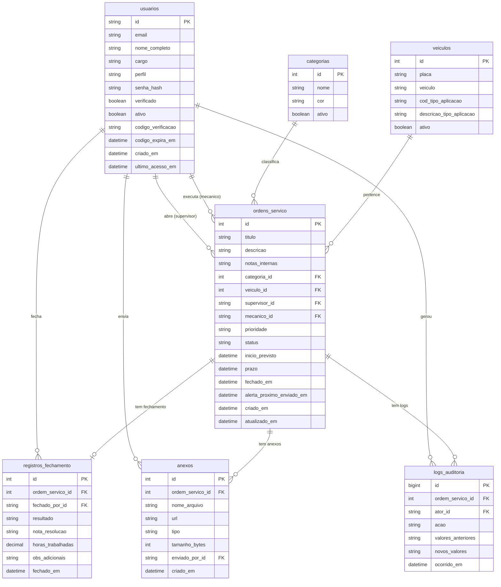

# 03 — Entidades do Banco de Dados

**Banco:** SQL Server 2022+ / Azure SQL  
**ORM:** Prisma 5.x  
**Schema:** `apps/api/prisma/schema.prisma`

---

## Tabelas

### `usuarios`

Representa todos os usuários do sistema (admins, supervisores e mecânicos).

| Campo | Tipo | Obrigatório | Descrição |
|---|---|---|---|
| `id` | UUID (String) | ✅ PK | Identificador único |
| `email` | String | ✅ Unique | Deve ser `@metalsider.com.br` |
| `nome_completo` | String | ✅ | Nome completo |
| `cargo` | String | ❌ | Cargo/função na empresa |
| `perfil` | Enum | ✅ | `supervisor` \| `mecanico` \| `admin` |
| `senha_hash` | String | ❌ | Hash bcrypt (null enquanto não finaliza cadastro) |
| `verificado` | Boolean | ✅ | `false` até finalizar cadastro |
| `ativo` | Boolean | ✅ | `false` = desativado (soft-delete) |
| `codigo_verificacao` | String | ❌ | Hash bcrypt do código de 6 dígitos |
| `codigo_expira_em` | DateTime | ❌ | Expiração do código (30 min) |
| `criado_em` | DateTime | ✅ | Timestamp de criação |
| `ultimo_acesso_em` | DateTime | ❌ | Último login registrado |

**Relações:**
- `ordens_como_supervisor` → muitas `ordens_servico` (como supervisor responsável)
- `ordens_como_mecanico` → muitas `ordens_servico` (como mecânico atribuído)
- `registros_fechamento` → muitos `registros_fechamento` (fechou quais OSs)
- `anexos` → muitos `anexos` (fez upload de quais arquivos)
- `logs_auditoria` → muitos `logs_auditoria` (ator de cada evento)

---

### `ordens_servico`

Núcleo do sistema — representa cada chamado/ordem de serviço.

| Campo | Tipo | Obrigatório | Descrição |
|---|---|---|---|
| `id` | Int (auto-increment) | ✅ PK | ID sequencial visível para o usuário |
| `titulo` | String | ✅ | Título curto da OS |
| `descricao` | String | ❌ | Descrição detalhada do problema |
| `notas_internas` | String | ❌ | Notas privadas (visível apenas a supervisor/admin) |
| `categoria_id` | Int | ✅ FK | Categoria da OS |
| `veiculo_id` | Int | ✅ FK | Veículo/equipamento envolvido |
| `supervisor_id` | UUID | ✅ FK | Supervisor que abriu a OS |
| `mecanico_id` | UUID | ❌ FK | Mecânico atribuído (pode ser nulo) |
| `prioridade` | Enum | ✅ | `baixa` \| `media` \| `alta` \| `critica` |
| `status` | Enum | ✅ | `aberto` \| `fechado` \| `atrasado` |
| `inicio_previsto` | DateTime | ✅ | Data/hora de início prevista |
| `prazo` | DateTime | ✅ | Deadline calculado pelo SLA |
| `fechado_em` | DateTime | ❌ | Quando foi fechada (null se aberta) |
| `alerta_proximo_enviado_em` | DateTime | ❌ | Controle de idempotência dos alertas SLA |
| `criado_em` | DateTime | ✅ | Timestamp de criação |
| `atualizado_em` | DateTime | ✅ | Última modificação (auto-update) |

**Indexes de performance:**
- `(status, mecanico_id)` — filtros da listagem de mecânicos
- `(status, prazo)` — monitoramento de SLA
- `(supervisor_id, criado_em DESC)` — listagem por supervisor
- `(status, prioridade)` — filtros por prioridade
- `(categoria_id, status)` — analytics por categoria
- `(criado_em DESC)` — ordenação cronológica

**Relações:**
- `supervisor` → `usuarios`
- `mecanico` → `usuarios`
- `categoria` → `categorias`
- `veiculo` → `veiculos`
- `fechamento` → um `registros_fechamento` (1:1)
- `anexos` → muitos `anexos`
- `logs` → muitos `logs_auditoria`

---

### `registros_fechamento`

Armazena os dados do momento em que uma OS foi concluída. Relação 1:1 com `ordens_servico`.

| Campo | Tipo | Obrigatório | Descrição |
|---|---|---|---|
| `id` | Int (auto-increment) | ✅ PK | — |
| `ordem_servico_id` | Int | ✅ FK Unique | OS que foi fechada |
| `fechado_por_id` | UUID | ✅ FK | Usuário que fechou |
| `resultado` | Enum | ✅ | `concluido` \| `parcial` \| `nao_resolvido` |
| `nota_resolucao` | String | ✅ | Descrição do que foi feito |
| `horas_trabalhadas` | Decimal(6,2) | ❌ | Horas registradas (ex: 2.50 = 2h30min) |
| `obs_adicionais` | String | ❌ | Observações extras |
| `fechado_em` | DateTime | ✅ | Timestamp do fechamento |

---

### `anexos`

Arquivos anexados a uma OS (fotos, PDFs, documentos).

| Campo | Tipo | Obrigatório | Descrição |
|---|---|---|---|
| `id` | Int (auto-increment) | ✅ PK | — |
| `ordem_servico_id` | Int | ✅ FK | OS à qual o arquivo pertence |
| `nome_arquivo` | String | ✅ | Nome original do arquivo |
| `url` | String | ✅ | URL no Azure Blob Storage (ou `/uploads/...` local) |
| `tipo` | String | ✅ | MIME type (ex: `image/jpeg`) |
| `tamanho_bytes` | Int | ✅ | Tamanho do arquivo (máx 10 MB = 10.485.760 bytes) |
| `enviado_por_id` | UUID | ✅ FK | Usuário que fez o upload |
| `criado_em` | DateTime | ✅ | Timestamp do upload |

---

### `categorias`

Tipos/categorias de serviço (ex: "Elétrico", "Motor", "Hidráulico").

| Campo | Tipo | Obrigatório | Descrição |
|---|---|---|---|
| `id` | Int (auto-increment) | ✅ PK | — |
| `nome` | String | ✅ Unique | Nome da categoria |
| `cor` | String | ❌ | Cor hexadecimal (ex: `#FF5733`) para UI |
| `ativo` | Boolean | ✅ | `false` = desativada (soft-delete) |

---

### `veiculos`

Veículos ou equipamentos industriais que podem ter OSs abertas.

| Campo | Tipo | Obrigatório | Descrição |
|---|---|---|---|
| `id` | Int (auto-increment) | ✅ PK | — |
| `placa` | String | ❌ | Placa do veículo (se aplicável) |
| `veiculo` | String | ✅ Unique | Identificador/nome do veículo |
| `cod_tipo_aplicacao` | String | ❌ | Código interno do tipo de aplicação |
| `descricao_tipo_aplicacao` | String | ❌ | Descrição do tipo de aplicação |
| `ativo` | Boolean | ✅ | `false` = desativado (soft-delete) |

---

### `logs_auditoria`

Registro imutável de todos os eventos do sistema. **Nunca deve ser editado ou excluído.**

| Campo | Tipo | Obrigatório | Descrição |
|---|---|---|---|
| `id` | BigInt (auto-increment) | ✅ PK | ID sequencial de alta cardinalidade |
| `ordem_servico_id` | Int | ❌ FK | OS relacionada (null para eventos de usuário) |
| `ator_id` | UUID | ❌ FK | Usuário que realizou a ação |
| `acao` | String | ✅ | Código da ação (ver tabela abaixo) |
| `valores_anteriores` | String | ❌ | JSON com valores antes da alteração |
| `novos_valores` | String | ❌ | JSON com valores após a alteração |
| `ocorrido_em` | DateTime | ✅ | Timestamp exato do evento |

**Ações registradas:**

| Código | Quando ocorre |
|---|---|
| `OS_CRIADA` | Nova OS criada |
| `OS_EDITADA` | OS atualizada |
| `OS_FECHADA` | OS concluída |
| `OS_ATRASADA` | SLA vencido (job automático) |
| `OS_ANEXO_ADICIONADO` | Upload de arquivo |
| `OS_ANEXO_REMOVIDO` | Remoção de arquivo |
| `USUARIO_CRIADO` | Novo usuário criado |
| `USUARIO_EDITADO` | Dados do usuário alterados |

**Index:** `(ordem_servico_id, ocorrido_em DESC)` — otimiza a timeline de uma OS.

---

## Diagrama ER (Entidade-Relacionamento)

---

## Enums

| Enum | Valores |
|---|---|
| `PerfilUsuario` | `supervisor`, `mecanico`, `admin` |
| `PrioridadeOS` | `baixa`, `media`, `alta`, `critica` |
| `StatusOS` | `aberto`, `fechado`, `atrasado` |
| `ResultadoFechamento` | `concluido`, `parcial`, `nao_resolvido` |

---

## Regras de Integridade

- **Logs de auditoria são imutáveis** — sem UPDATE/DELETE na tabela `logs_auditoria`
- **Usuários têm soft-delete** — campo `ativo: false` em vez de DELETE
- **Veículos e categorias têm soft-delete** — campo `ativo: false`
- **OS deletada** → status muda para `cancelado` (soft-delete lógico)
- **Veículo não pode ser excluído** se houver OSs associadas
- **Usuário não pode ser excluído** se houver registros relacionados
