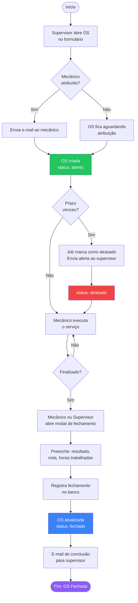
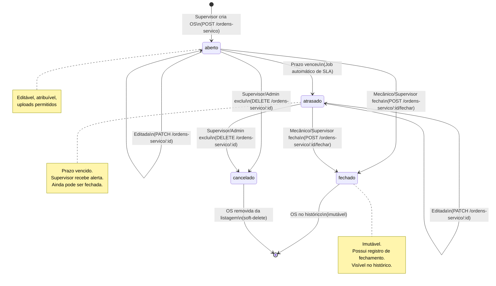

# 04 — Fluxo de Ordem de Serviço

## Ciclo de Vida Completo

Uma Ordem de Serviço (OS) percorre o seguinte ciclo: desde a sua abertura pelo supervisor, passando pela execução pelo mecânico, até o fechamento com registro de resultado.

---

## Passo a Passo

### 1. Criação da OS (Supervisor/Admin)

- Supervisor preenche o formulário em `/chamados/novo`
- Campos obrigatórios: título, veículo, categoria, prioridade, data de início prevista
- Campos opcionais: mecânico atribuído, descrição, notas internas, duração estimada
- O sistema **calcula automaticamente o prazo (SLA)** baseado na prioridade:

| Prioridade | 
|---|---|
| **Crítica** | 2 horas |
| **Alta** | 8 horas |
| **Média** | 2 dias úteis |
| **Baixa** | 5 dias úteis |

- OS criada com status `aberto`
- Evento SSE emitido para atualizar todos os clientes em tempo real
- E-mail de notificação enviado ao mecânico atribuído (se houver)
- Log de auditoria `OS_CRIADA` registrado

### 2. Atribuição do Mecânico

- Pode ocorrer na criação ou depois, via edição da OS
- Supervisor seleciona mecânico disponível na listagem de usuários
- E-mail enviado ao mecânico notificando a atribuição
- Log `OS_EDITADA` registrado com valores anteriores/novos

### 3. Execução pelo Mecânico

- Mecânico acessa `/chamados` e vê apenas suas OSs atribuídas
- Pode visualizar detalhes: veículo, descrição, categoria, prioridade, prazo
- **Notas internas nunca são exibidas ao mecânico**
- Mecânico pode fazer upload de anexos (fotos, documentos) como evidências
- OS permanece com status `aberto` durante toda a execução

### 4. Monitoramento de SLA (Automático)

- Background job verifica periodicamente todas as OSs abertas
- Se `prazo < now()` e status ainda é `aberto` → muda para `atrasado`
- Envia e-mail de alerta ao supervisor
- Campo `alerta_proximo_enviado_em` garante idempotência (e-mail enviado apenas uma vez)
- Log `OS_ATRASADA` registrado

### 5. Fechamento da OS

**Quem pode fechar:**
- Mecânico atribuído → fecha sua própria OS
- Supervisor/Admin → pode fechar qualquer OS (situação de emergência, com auditoria)

**Dados obrigatórios no fechamento:**
- Resultado: `concluido` | `parcial` | `nao_resolvido`
- Nota de resolução (texto descrevendo o que foi feito)

**Dados opcionais:**
- Horas trabalhadas (decimal, ex: `2.5` = 2h30min)
- Observações adicionais

**Ao fechar:**
1. Registro em `registros_fechamento` criado (1:1 com a OS)
2. OS atualizada: `status → fechado`, `fechado_em → now()`
3. Evento SSE emitido
4. E-mail de confirmação enviado ao supervisor
5. Log `OS_FECHADA` registrado com resultado

---

## Fluxograma do Ciclo de Vida



---

## Diagrama de Estados



---

## Cálculo de SLA em Detalhes

O prazo é calculado pela função `calcularPrazo(prioridade, inicio_previsto)` no serviço:

```
Crítica  → inicio_previsto + 2 horas
Alta     → inicio_previsto + 8 horas
Média    → inicio_previsto + 2 dias úteis (48h)
Baixa    → inicio_previsto + 5 dias úteis (120h)
```

> **Dias úteis:** atualmente implementado como dias corridos × horas. <!-- TODO: confirmar com o time se feriados são considerados -->

---

## Notificações por E-mail

| Evento | Destinatário | Trigger |
|---|---|---|
| OS criada com mecânico | Mecânico | Criação da OS |
| Mecânico atribuído | Mecânico | Edição que define mecânico |
| SLA vencido | Supervisor | Job automático |
| OS fechada | Supervisor | Fechamento da OS |
