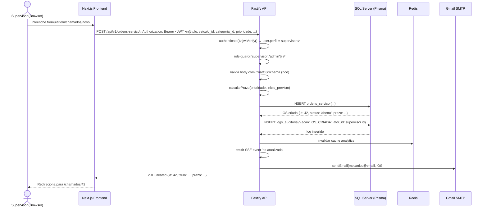
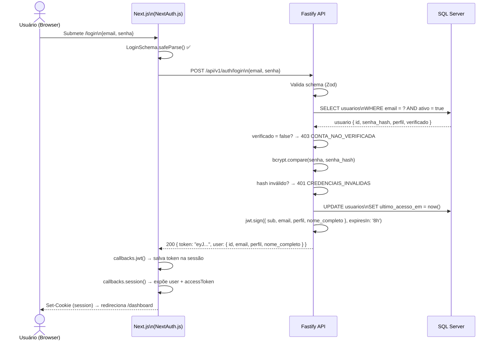

# 05 — Arquitetura da API

**Base URL:** `/api/v1`  
**Framework:** Fastify 4.x  
**Autenticação:** Bearer JWT (header `Authorization: Bearer <token>`)

---

## Visão Geral dos Módulos

| Módulo | Prefixo | Descrição |
|---|---|---|
| Health | `/health` | Status da API |
| Auth | `/auth` | Login, cadastro, verificação, recuperação de senha |
| Ordens de Serviço | `/ordens-servico` | CRUD completo + SSE + auditoria + anexos |
| Usuários | `/usuarios` | Perfil próprio + gerenciamento (admin) |
| Categorias | `/categorias` | CRUD de categorias (admin) |
| Veículos | `/veiculos` | CRUD de veículos (admin) |
| Analytics | `/analytics` | KPIs e gráficos do dashboard |

---

## Tabela de Rotas por Módulo

### Health

| Método | Rota | Auth | Descrição |
|---|---|---|---|
| `GET` | `/health` | Não | Status da API, versão, ambiente |

---

### Auth — `/auth`

| Método | Rota | Auth | Rate Limit | Descrição |
|---|---|---|---|---|
| `POST` | `/auth/login` | Não | 5 req/min | Login com email + senha → retorna JWT |
| `POST` | `/auth/registrar` | Não | 5 req/min | Registro público (supervisor/mecânico) — Etapa 1 |
| `POST` | `/auth/verificar-codigo-cadastro` | Não | 10 req/min | Verifica código de 6 dígitos — Etapa 2 |
| `POST` | `/auth/finalizar-cadastro` | Não | 5 req/min | Define senha e ativa conta — Etapa 3 |
| `POST` | `/auth/reenviar-codigo` | Não | 3 req/min | Reenvia código de verificação por email |
| `POST` | `/auth/solicitar-recuperacao-senha` | Não | 3 req/min | Envia código de recuperação por email |
| `POST` | `/auth/redefinir-senha` | Não | 5 req/min | Redefine senha com código válido |
| `POST` | `/auth/ativar-conta` | Não | 5 req/min | Ativação legada (contas criadas por admin) |

---

### Ordens de Serviço — `/ordens-servico`

| Método | Rota | Auth | Perfis | Descrição |
|---|---|---|---|---|
| `GET` | `/ordens-servico` | ✅ | Todos | Lista com paginação, filtros e ordenação |
| `GET` | `/ordens-servico/contagem` | ✅ | Todos | Apenas contagem (para badge da sidebar) |
| `GET` | `/ordens-servico/stream` | ✅ | Todos | Server-Sent Events para atualizações em tempo real |
| `GET` | `/ordens-servico/:id` | ✅ | Todos | Detalhes com fechamento, anexos, supervisor, mecânico |
| `POST` | `/ordens-servico` | ✅ | supervisor, admin | Cria nova OS com cálculo automático de SLA |
| `PATCH` | `/ordens-servico/:id` | ✅ | supervisor, admin | Atualiza OS (parcial) |
| `POST` | `/ordens-servico/:id/fechar` | ✅ | Todos | Fecha OS com resultado, horas e notas |
| `DELETE` | `/ordens-servico/:id` | ✅ | supervisor, admin | Soft-delete (status → cancelado) |
| `GET` | `/ordens-servico/:id/auditoria` | ✅ | supervisor, admin | Log imutável de eventos da OS |
| `POST` | `/ordens-servico/:id/anexos` | ✅ | Todos | Upload de arquivo (`multipart/form-data`, máx 10 MB) |
| `DELETE` | `/ordens-servico/:id/anexos/:anexo_id` | ✅ | supervisor, admin | Remove anexo da OS e do storage |

**Filtros disponíveis em `GET /ordens-servico`:**

| Parâmetro | Tipo | Descrição |
|---|---|---|
| `status` | string | `aberto` \| `fechado` \| `atrasado` |
| `prioridade` | string | `baixa` \| `media` \| `alta` \| `critica` |
| `categoria_id` | int | ID da categoria |
| `mecanico_id` | uuid | ID do mecânico |
| `supervisor_id` | uuid | ID do supervisor |
| `busca` | string | Busca no título e descrição |
| `de` / `ate` | date | Intervalo de data de criação |
| `fechado_de` / `fechado_ate` | date | Intervalo de data de fechamento |
| `pagina` | int | Página (padrão: 1) |
| `por_pagina` | int | Itens por página (padrão: 20, máx: 100) |
| `orderBy` | string | Campo de ordenação |
| `order` | `asc` \| `desc` | Direção da ordenação |

---

### Usuários — `/usuarios`

| Método | Rota | Auth | Perfis | Descrição |
|---|---|---|---|---|
| `GET` | `/usuarios/eu` | ✅ | Todos | Perfil do usuário autenticado |
| `GET` | `/usuarios` | ✅ | Todos | Lista todos os usuários (para seletores) |
| `POST` | `/usuarios` | ✅ | admin | Cria usuário (senha padrão: `metal@10`) |
| `GET` | `/usuarios/:id` | ✅ | supervisor, admin | Detalhes de um usuário |
| `PATCH` | `/usuarios/:id` | ✅ | admin | Atualiza nome e/ou perfil |
| `PATCH` | `/usuarios/:id/perfil` | ✅ | admin | Altera apenas o perfil/role |
| `PATCH` | `/usuarios/:id/desativar` | ✅ | admin | Soft-delete (bloqueia acesso) |
| `DELETE` | `/usuarios/:id` | ✅ | admin | Exclusão permanente (bloqueada se tiver registros) |

---

### Categorias — `/categorias`

| Método | Rota | Auth | Perfis | Descrição |
|---|---|---|---|---|
| `GET` | `/categorias` | ✅ | Todos | Lista categorias ativas (cache 60s + SWR 300s) |
| `POST` | `/categorias` | ✅ | admin | Cria nova categoria |
| `PATCH` | `/categorias/:id` | ✅ | admin | Atualiza nome/cor da categoria |
| `PATCH` | `/categorias/:id/desativar` | ✅ | admin | Soft-delete |

---

### Veículos — `/veiculos`

| Método | Rota | Auth | Perfis | Descrição |
|---|---|---|---|---|
| `GET` | `/veiculos` | ✅ | Todos | Lista veículos ativos (com cache) |
| `POST` | `/veiculos` | ✅ | admin | Cadastra veículo |
| `PATCH` | `/veiculos/:id` | ✅ | admin | Atualiza dados do veículo |
| `PATCH` | `/veiculos/:id/desativar` | ✅ | admin | Soft-delete |
| `DELETE` | `/veiculos/:id` | ✅ | admin | Exclusão permanente (bloqueada se tiver OSs) |

---

### Analytics — `/analytics`

| Método | Rota | Auth | Descrição |
|---|---|---|---|
| `GET` | `/analytics/kpis` | ✅ | KPIs: total aberto, fechado, atrasado, TMR, SLA% |
| `GET` | `/analytics/por-categoria` | ✅ | Volume de OSs por categoria |
| `GET` | `/analytics/tendencia` | ✅ | Série temporal (abertas/fechadas por período) |
| `GET` | `/analytics/por-prioridade` | ✅ | Distribuição por prioridade |
| `GET` | `/analytics/mecanicos` | ✅ | Ranking de mecânicos (fechadas, no prazo, SLA%) |
| `GET` | `/analytics/heatmap` | ✅ | Mapa de calor (dia da semana × semana) |
| `GET` | `/analytics/mais-longos` | ✅ | OSs com maior tempo de resolução |
| `GET` | `/analytics/atrasados-por-categoria` | ✅ | OSs atrasadas agrupadas por categoria |

**Parâmetro de período (todos os endpoints analytics):**

| Parâmetro | Valores | Descrição |
|---|---|---|
| `periodo` | `7d`, `30d`, `90d`, `personalizado` | Janela de tempo |
| `de` | date (ISO 8601) | Obrigatório se `periodo=personalizado` |
| `ate` | date (ISO 8601) | Obrigatório se `periodo=personalizado` |

---

## Camadas da Aplicação

```
Routes (apps/api/src/routes/)
  └─ define método, path, schema Zod de validação
  └─ chama authenticate + role-guard (middlewares)
     └─ Services (apps/api/src/services/)
          └─ regras de negócio, SLA, e-mails, SSE
          └─ Repositories (apps/api/src/repositories/)
               └─ queries Prisma ao SQL Server
               └─ Redis (cache de listas/analytics)
```

---

## Diagrama de Sequência — Criar Ordem de Serviço



---

## Diagrama de Sequência — Autenticar Usuário



---

## Middleware de Autenticação

```
Request → authenticate.ts
  ├─ Header Authorization: Bearer <token>? → jwtVerify()
  │     ✅ Valid → request.user = { sub, email, perfil }
  │     ❌ Invalid/missing → 401 Unauthorized
  └─ role-guard(['supervisor','admin'])
        ✅ request.user.perfil in allowedRoles → continua
        ❌ Perfil não permitido → 403 Forbidden
```

---

## Formato de Resposta de Erro

Todos os erros seguem o padrão:

```json
{
  "statusCode": 400,
  "error": "Bad Request",
  "code": "VALIDACAO_FALHOU",
  "message": "titulo: String must contain at least 3 character(s)"
}
```

**Códigos de erro comuns:**

| Código | HTTP | Descrição |
|---|---|---|
| `CREDENCIAIS_INVALIDAS` | 401 | Email ou senha incorretos |
| `CONTA_NAO_VERIFICADA` | 403 | Conta aguardando ativação |
| `CONTA_INATIVA` | 403 | Conta desativada pelo admin |
| `CODIGO_INVALIDO` | 400 | Código expirado ou incorreto |
| `VALIDACAO_FALHOU` | 400 | Schema Zod não passou |
| `NAO_AUTORIZADO` | 403 | Perfil sem permissão para esta rota |
| `RECURSO_NAO_ENCONTRADO` | 404 | ID não existe no banco |
| `CONFLITO` | 409 | Email já cadastrado, veículo com OS associada, etc. |
