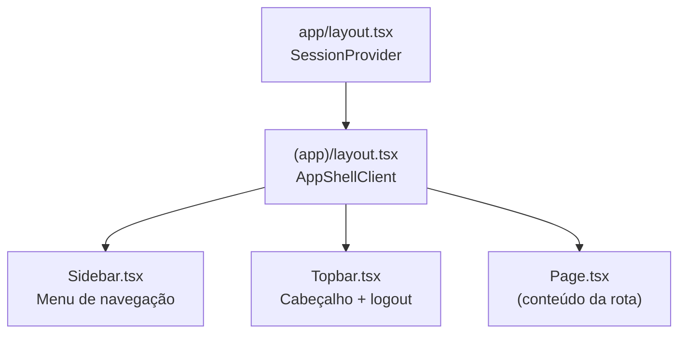
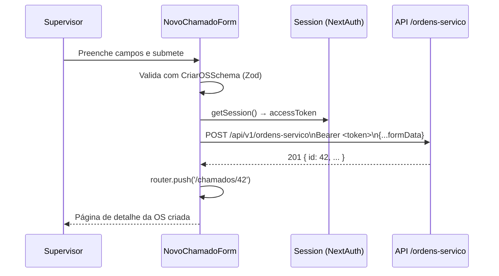

# 06 — Componentes do Frontend

**Framework:** Next.js 15 com App Router  
**Linguagem:** TypeScript + React 19  
**Estilos:** CSS Modules + Design Tokens  
**Localização do código:** `apps/web/src/`

---

## Páginas (App Router)

### Páginas Públicas — `app/(auth)/`

Rotas que não exigem autenticação. O middleware do Next.js redireciona usuários autenticados para o dashboard.

| Rota | Arquivo | O que exibe |
|---|---|---|
| `/login` | `(auth)/login/page.tsx` | Formulário de login com email e senha |
| `/cadastro` | `(auth)/cadastro/page.tsx` | Registro em 3 etapas (etapa 1: dados pessoais/email, etapa 2: código recebido, etapa 3: definir senha) |
| `/ativar-conta` | `(auth)/ativar-conta/page.tsx` | Ativação de conta criada pelo admin (fluxo legado) |
| `/recuperar-senha` | `(auth)/recuperar-senha/page.tsx` | Recuperação de senha via código enviado por e-mail |

---

### Páginas Protegidas — `app/(app)/`

Envolvidas pelo `AppShellClient` (sidebar + topbar). Exigem sessão NextAuth válida.

| Rota | Arquivo | Quem acessa | O que exibe |
|---|---|---|---|
| `/dashboard` | `(app)/dashboard/page.tsx` | Todos | KPIs em tempo real, gráficos de tendência, ranking de mecânicos, distribuição por categoria |
| `/chamados` | `(app)/chamados/page.tsx` | Todos | Lista paginada de OSs com filtros, busca e badge de contagem |
| `/chamados/novo` | `(app)/chamados/novo/page.tsx` | Supervisor, Admin | Formulário de criação de OS com cálculo de SLA |
| `/chamados/[id]` | `(app)/chamados/[id]/page.tsx` | Todos | Detalhes da OS: informações, fechamento, anexos, timeline de auditoria |
| `/historico` | `(app)/historico/page.tsx` | Todos | OSs históricas com filtros avançados e drawer de detalhes |
| `/configuracoes` | `(app)/configuracoes/page.tsx` | Admin | Abas: Usuários, Veículos, Categorias (CRUD completo) |

---

## Estrutura de Layout (Authenticated Shell)



---

## Componentes por Módulo

### Layout — `components/layout/`

| Componente | Arquivo | Função |
|---|---|---|
| `AppShellClient` | `AppShellClient.tsx` | Container principal: sidebar + topbar + área de conteúdo |
| `Sidebar` | `Sidebar.tsx` | Menu lateral com links por perfil (badge com contagem de OSs abertas), estado recolhido/aberto |
| `Topbar` | `Topbar.tsx` | Cabeçalho com nome do usuário, perfil e botão de logout |

---

### UI Primitivos — `components/ui/`

Componentes reutilizáveis de baixo nível, sem lógica de negócio.

| Componente | Função |
|---|---|
| `Button` | Botão com variantes (primary, secondary, danger, ghost) e estados de loading |
| `Input` | Campo de texto, email, senha com label e mensagem de erro |
| `Select` | Dropdown com opções configuráveis |
| `Modal` | Diálogo com overlay, título, conteúdo e ações |
| `Drawer` | Painel lateral deslizante (usado para detalhes) |
| `Badge` | Tag colorida para status e prioridade |
| `Avatar` | Círculo com inicial do nome ou foto de perfil |
| `Card` | Container com sombra e padding |
| `Skeleton` | Placeholder animado para carregamento |
| `Toast` | Notificação de sucesso/erro/info (auto-dismiss) |
| `EmptyState` | Ilustração + mensagem quando lista está vazia |

---

### Ordens de Serviço — `components/chamados/`

| Componente | Arquivo | Função |
|---|---|---|
| `ChamadosClient` | `ChamadosClient.tsx` | Página de listagem: busca, filtros, paginação, SSE para atualizações em tempo real |
| `FilterBar` | `FilterBar.tsx` | Barra de filtros: status, prioridade, categoria, mecânico, data |
| `OSCard` | `OSCard.tsx` | Card de uma OS na listagem: título, veículo, mecânico, status, prioridade, prazo |
| `NovoChamadoForm` | `NovoChamadoForm.tsx` | Formulário de criação de OS com seleção de veículo/categoria/mecânico e cálculo de SLA |
| `EditarOSModal` | `EditarOSModal.tsx` | Modal para editar OS existente |
| `ExcluirOSModal` | `ExcluirOSModal.tsx` | Modal de confirmação de exclusão (soft-delete) |
| `FecharModal` | `FecharModal.tsx` | Modal de fechamento: resultado, horas trabalhadas, nota de resolução |
| `UploadAnexos` | `UploadAnexos.tsx` | Drag-and-drop para upload de arquivos (máx 10 MB, com preview e progresso) |

---

### Dashboard — `components/dashboard/`

| Componente | Arquivo | Função |
|---|---|---|
| `DashboardClientWrapper` | `DashboardClientWrapper.tsx` | Wrapper com `<Suspense>` e `<ErrorBoundary>` |
| `DashboardClient` | `DashboardClient.tsx` | Busca dados de analytics e renderiza todos os widgets |
| `KpiCard` | `KpiCard.tsx` | Card único de KPI com número, rótulo e tendência |
| `PeriodSelector` | `PeriodSelector.tsx` | Seletor de período (7d, 30d, 90d, personalizado) |

**Gráficos usados (Recharts):**
- Gráfico de linha: tendência de abertura vs. fechamento
- Gráfico de barras: distribuição por categoria e por prioridade
- Gráfico de pizza: SLA compliance
- Mapa de calor: distribuição por dia da semana

---

### Histórico & Auditoria — `components/historico/`

| Componente | Arquivo | Função |
|---|---|---|
| `HistoricoClient` | `HistoricoClient.tsx` | Container da página de histórico |
| `FiltrosPainel` | `FiltrosPainel.tsx` | Painel lateral de filtros avançados |
| `TabelaHistorico` | `TabelaHistorico.tsx` | Tabela com OSs históricas, paginação e ordenação |
| `DrawerDetalhes` | `DrawerDetalhes.tsx` | Drawer com detalhes completos + timeline ao clicar em uma linha |
| `TimelineAuditoria` | `TimelineAuditoria.tsx` | Linha do tempo visual com todos os eventos de uma OS |

---

### Admin — `components/admin/`

| Componente | Arquivo | Função |
|---|---|---|
| `ConfiguracoesClient` | `ConfiguracoesClient.tsx` | Página com abas: Usuários, Veículos, Categorias |
| `UsuariosTab` | `UsuariosTab.tsx` | Lista de usuários com criação, edição, troca de perfil, desativação |
| `VeiculosTab` | `VeiculosTab.tsx` | Lista de veículos com CRUD e soft-delete |
| `CategoriasTab` | `CategoriasTab.tsx` | Lista de categorias com CRUD, cor e soft-delete |

---

## Como o Frontend Comunica com a API

### Autenticação

1. `NextAuth.js` gerencia a sessão (cookie HTTP-only com token JWT)
2. O `accessToken` fica armazenado dentro da sessão NextAuth
3. Todas as chamadas autenticadas incluem `Authorization: Bearer <accessToken>`

### Chamadas de API

Funções de cliente em `apps/web/src/lib/api/`:

```
lib/api/
├── ordens-servico.ts    ← fetch de OSs, criar, editar, fechar, etc.
├── usuarios.ts          ← fetch de usuários
├── categorias.ts        ← fetch de categorias
├── veiculos.ts          ← fetch de veículos
└── analytics.ts         ← fetch de KPIs e gráficos
```

Cada função:
1. Obtém o `accessToken` da sessão (`auth()` do NextAuth no server, `useSession()` no client)
2. Faz `fetch` para `NEXT_PUBLIC_API_URL + rota`
3. Inclui `Authorization: Bearer <token>`
4. Valida/tipifica a resposta com os schemas do `packages/shared`

### Server-Sent Events (Tempo Real)

O componente `ChamadosClient` abre uma conexão SSE com `/ordens-servico/stream` após montar:

```
Browser → GET /api/v1/ordens-servico/stream (EventSource)
API     → envia evento quando qualquer OS é criada/editada/fechada
Browser → atualiza a lista automaticamente sem refresh
```

---

## Middleware do Next.js

**Arquivo:** `apps/web/src/middleware.ts`

Intercepta todas as requisições e:
- Redireciona para `/login` se usuário não autenticado acessar rota protegida `(app)/`
- Redireciona para `/dashboard` se usuário autenticado acessar rota pública `(auth)/`
- Protege rotas de admin (ex: `/configuracoes`) verificando o perfil na sessão

---

## Fluxo de Dados — Criação de OS no Frontend


